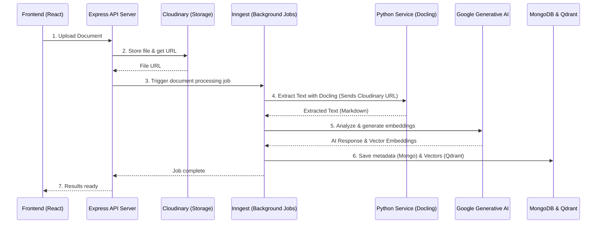

# Hackathon Application Pipeline

This project is a full-stack application built for text extraction, analysis, and data storage. It utilizes a React frontend, an Express-based main backend server, background job processing with Inngest, and a Python microservice for robust document extraction.

## Prerequisites
- Node.js (v18+)
- Python (3.10+)
- Access to Cloudinary, MongoDB, Qdrant, and Clerk accounts (set via `.env` variables)

## Architecture & Pipeline

Here is the complete data flow pipeline representing a document upload event:



## How to Start the Services

To run this application locally, you will need multiple terminal windows or tabs to start each service.

### 1. Start the Frontend (React / Vite)

Navigate to the `frontend` directory, install dependencies, and start the development server.

```bash
cd frontend
npm install
npm run dev
```
The frontend will start on your local Vite port (usually `http://localhost:5173`).

### 2. Start the Express Server (Backend)

Navigate to the `server` directory, install dependencies, and start the backend development server.

```bash
cd server
npm install
npm run dev
```
This runs the application using `nodemon`. The backend server usually starts on `http://localhost:5000` (or the port defined in your `.env`).

### 3. Start the Inngest Dev Server (For Background Jobs)

The Express server relies on Inngest for background jobs. You need to run the Inngest local simulator.

Open another terminal in the `server` directory:
```bash
cd server
npx inngest-cli@latest dev
```
This will open the Inngest dashboard locally at `http://localhost:8288` to monitor background functions.

### 4. Start the Python Service (Extraction Service)

The python service provides FastAPI endpoints for the Docling document extraction. 

Navigate to the `python-service` directory, activate the virtual environment, install the reqs, and start Uvicorn.

**Windows:**
```cmd
cd python-service
.venv\Scripts\activate.bat
pip install -r requirements.txt
uvicorn main:app --reload
```

**MacOS/Linux/Git Bash:**
```bash
cd python-service
source .venv/Scripts/activate
pip install -r requirements.txt
uvicorn main:app --reload
```
The Python service will start on `http://127.0.0.1:8000`. You can test its health endpoint natively by visiting `http://127.0.0.1:8000/docs`.

---
**Summary of Local Servers:**
- **Frontend Vite:** `http://localhost:5173`
- **Express API Server:** `http://localhost:5000`
- **Inngest Simulator:** `http://localhost:8288`
- **Python FastAPI:** `http://localhost:8000`
